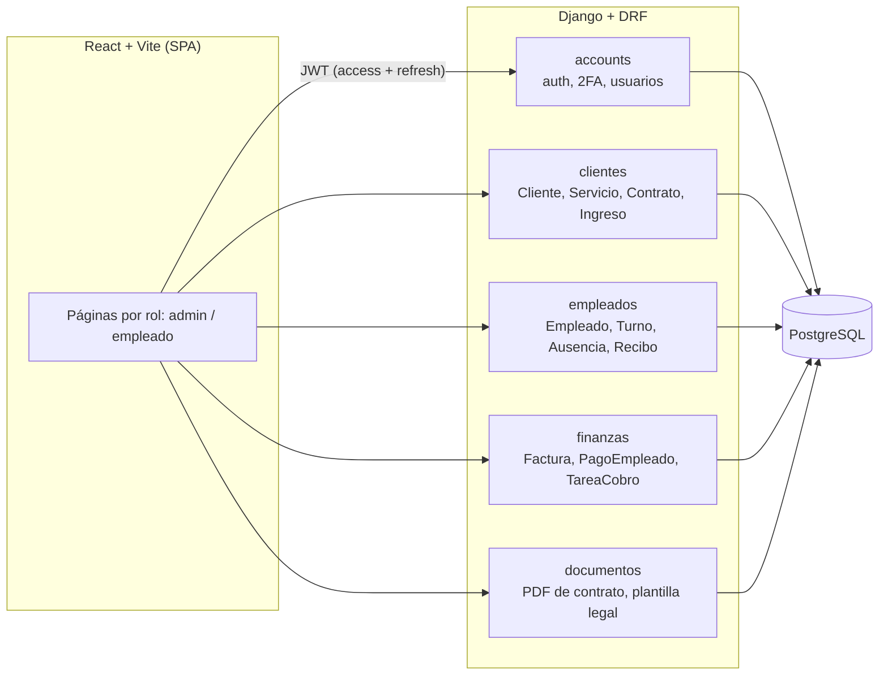
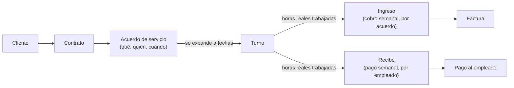

# Gestión de Servicios

Sistema de **gestión de clientes + servicios programados + personal + facturación**,
para cualquier negocio que opere por proyectos o servicios recurrentes (limpieza,
mantenimiento, técnicos de campo, consultoría...). No es un ejercicio de práctica: es
la arquitectura de un sistema real en producción, generalizada para portfolio —
mismos modelos, misma lógica de negocio, mismas decisiones de seguridad, solo que sin
el rubro, el branding ni los datos del negocio del que salió.

> Ver [`PLAN_GENERALIZACION_PORTFOLIO.md`](PLAN_GENERALIZACION_PORTFOLIO.md) para el
> detalle fase por fase de qué se generalizó y por qué; este README es el resumen para
> quien solo quiere entender el proyecto.

## Qué resuelve

Una empresa que vende servicios programados necesita, como mínimo:

- Saber **a qué se comprometió** con cada cliente (qué servicio, con qué empleado, qué
  días, a qué precio).
- Convertir eso en una **agenda real** (turnos concretos, no solo un patrón semanal).
- Saber **quién trabajó y cuánto**, incluyendo sustituciones y ausencias.
- **Facturar** por lo trabajado, no por lo planificado.
- **Pagarle al personal** lo que corresponde, aunque la semana se haya repartido entre
  dos personas.

Ese es el recorrido que cubre este sistema, de punta a punta.

## Cómo correrlo local

Solo local — no hay despliegue, ni CORS de producción, ni URLs de hosting. Corre
enteramente en tu máquina.

**Requisitos:** Python 3.11+, Node 20+, PostgreSQL corriendo en local (ver por qué
Postgres es obligatorio, no opcional, más abajo).

```bash
# Backend
cd backend
python -m venv venv

# Activar el entorno virtual (la sintaxis depende de tu terminal):
#   cmd.exe      venv\Scripts\activate.bat
#   PowerShell   venv\Scripts\Activate.ps1
#   Git Bash     source venv/Scripts/activate
#   macOS/Linux  source venv/bin/activate

pip install -r requirements.txt

cp .env.example .env    # cmd.exe: copy .env.example .env
# El .env.example trae los NOMBRES de las variables, pero SECRET_KEY y
# FIELD_ENCRYPTION_KEY quedan VACÍOS a propósito (son secretos, nunca se
# versionan) -- el siguiente paso, generarlos, no es opcional.

# Generá cada uno con estos comandos (misma terminal, entorno virtual activado):
python -c "import secrets; print(secrets.token_urlsafe(50))"
python -c "from cryptography.fernet import Fernet; print(Fernet.generate_key().decode())"
# Cada comando imprime un valor distinto. Abrí backend/.env con un editor de
# texto (el Bloc de notas sirve, o un editor de código como VS Code) y pegá
# cada valor en su variable: el primer comando va en SECRET_KEY, el segundo
# en FIELD_ENCRYPTION_KEY. Una sola línea cada uno, sin comillas.

# También completá DB_USER/DB_PASSWORD/DB_NAME en backend/.env con los datos
# de tu Postgres local.

# IMPORTANTE: para este paso necesitás PostgreSQL ya instalado y corriendo
# en tu máquina, con la base de datos (DB_NAME) ya creada -- migrate crea las
# tablas, pero no crea el servidor de Postgres ni la base en sí.
python manage.py migrate
python manage.py createsuperuser
python manage.py importar_csv    # carga clientes/ingresos de ejemplo (ver docs/importacion_ejemplo/)
python manage.py runserver
```

```bash
# Frontend, en otra terminal
cd frontend
npm install
npm run dev
```

Con eso: backend en `http://localhost:8000`, frontend en `http://localhost:5173`,
con datos de ejemplo (clientes, servicios, ingresos históricos) ya cargados.

## Arquitectura



### El recorrido de un servicio, de la firma al pago



`Ingreso` y `Recibo` nacen del mismo dato (`Turno.horas_reales`) pero con
granularidades distintas a propósito — ver más abajo.

## Decisiones de diseño (el porqué, no solo el qué)

Cualquiera puede nombrar un modelo `Cliente`. Lo que hace a este sistema un caso de
estudio son las decisiones detrás de cada uno — la mayoría vienen de resolver un
problema real, no de una preferencia estética.

### Seguridad en capas: JWT + 2FA + "reconfirmá tu identidad"

El login usa JWT (access + refresh) con TOTP opcional. Pero hay una segunda capa,
independiente del login: antes de una acción sensible (editar un contrato ya firmado,
cambiar la plantilla legal del contrato, cambiar tarifas del catálogo de servicios),
el sistema exige **reconfirmar la identidad** — contraseña, o el código de 2FA si ya
está activado — sin crear ninguna sesión elevada. Es el mismo patrón "sudo mode" que
usan herramientas de administración serias: tener la sesión abierta no alcanza para
tocar lo que importa. La verificación se revalida **del lado del servidor** en cada
endpoint protegido — el frontend la pide primero solo para no interrumpir con un error
recién al final del formulario.

### Campos cifrados a nivel de aplicación, no solo de disco

Datos personales (dirección, NIF, fecha de nacimiento, número de documento) están
cifrados con `django-encrypted-model-fields`, además de cualquier cifrado que ya tenga
la infraestructura de base de datos. La diferencia importa: si alguien obtiene un dump
crudo de la base (un backup mal guardado, un acceso indebido a la infraestructura),
esos campos siguen siendo texto cifrado, no texto plano. El costo real y documentado:
esos campos **no son buscables ni ordenables en SQL** — cualquier búsqueda por ellos
tiene que resolverse en la aplicación, no en la base.

### Compensación configurable por servicio, no un caso especial en el código

El sistema original tenía una categoría de personal que cobraba el 100% de lo
facturado (sin margen), como caso especial hardcodeado en el cálculo de pagos. Acá
esa regla se generalizó a un campo de configuración por servicio:
`compensacion_tipo` (`por_hora` | `porcentaje_base`) + `compensacion_valor`. El
mismo mecanismo que antes solo servía para un tipo de personal ahora sirve para
cualquier esquema de pago — por hora fija, o por un porcentaje de lo cobrado — sin
tocar código. Es el ejemplo más claro de la diferencia entre "generalizar" y
"renombrar": la regla de negocio en sí se rediseñó, no solo las etiquetas.

### Facturación agregada por semana, no por turno

Un turno se cobra apenas se registran las horas reales, pero **la factura no se
genera turno por turno** — se agrega semana a semana, ancla al lunes, y recién sobre
períodos ya cerrados (nunca una semana en curso). Es cómo factura un contador real: en
líneas por período, no un cobro por cada visita de dos horas. Además, `Ingreso` (lo
que se le cobra al cliente) y `TareaCobro`/`Recibo` (lo que se le paga al empleado)
son dos vistas del mismo trabajo con **granularidad distinta a propósito**: la factura
se agrupa por contrato completo (así la necesita el contador), el pago se desglosa por
empleado y semana (para que cada uno se pague y respalde por separado, incluso si hubo
una sustitución a mitad de semana).

### Generación "al paso", sin cron ni cola de tareas

No hay Celery, ni un scheduler, ni un worker en segundo plano. Turnos, ingresos,
recibos y tareas de cobro se generan la primera vez que alguien consulta la pantalla
que los necesita (`get_queryset()` revisa si falta generar algo, y lo genera ahí
mismo) — idempotente, respaldado por restricciones de base de datos, así que llamarlo
mil veces da el mismo resultado que llamarlo una vez. La ventaja: cero infraestructura
adicional para un negocio chico o mediano. El costo, real y documentado en el código:
la primera consulta del día paga la generación, y el costo crece con el histórico. La
migración natural cuando eso empiece a notarse es acotar el rango que recorren esas
funciones, o mover exactamente la misma lógica a un comando programado — están
escritas para eso desde el principio.

### Un empleado solo cubre servicios de su propia categoría — regla simétrica

Cuando un empleado sustituye a otro (por ausencia), el sistema exige que ambos sean de
la misma categoría de servicio — validado en tres lugares (al armar el contrato, al
asignar la sustitución, y al calcular quién cobra el turno ya trabajado), no confiado
a que alguien lo recuerde. Es una regla simple y pareja, pensada para generalizar a
cualquier negocio con categorías de personal (técnico junior/senior, limpieza
estándar/especializada), sin favorecer una categoría por sobre otra.

### El número de factura nunca lo asigna el sistema

`Factura.numero` es un campo de texto libre, editable a mano, no un contador
autogenerado. Reflejo de una realidad contable común: la numeración fiscal de
facturas suele ser responsabilidad de un software certificado o de la gestoría, no de
un sistema interno — si este sistema asignara su propia numeración, habría dos
secuencias en paralelo (la del sistema y la real) y la contabilidad quedaría
desalineada. Por eso una factura nace `pendiente`, sin número ni fechas, y se completa
recién cuando llega la respuesta real.

### Postgres es un requisito de diseño, no un detalle de infraestructura

`AcuerdoServicio.dias_semana` usa `ArrayField` (nativo de Postgres) en vez de, por
ejemplo, un `JSONField` portable. Es una decisión deliberada, no un descuido: reflejar
fielmente cómo está construido el sistema real en producción, en vez de suavizar el
stack para que corra en cualquier motor de base de datos. El costo es real y está
documentado desde la Fase 0 de este proyecto: no corre en SQLite.

## Stack

- **Backend:** Django 6 + Django REST Framework, PostgreSQL, JWT (`simplejwt`) + TOTP
  (`django-otp`), campos cifrados (`django-encrypted-model-fields`), auditoría
  (`django-auditlog`), PDF (`reportlab`).
- **Frontend:** React 19 + Vite + Tailwind CSS 4, `@tanstack/react-query`, `react-router-dom`.
- **Sin dependencias externas de pago:** el envío de correos usa el backend de
  consola de Django (queda impreso en la terminal); no hay proveedor de email, IA ni
  almacenamiento en la nube conectado.

## Estructura del repo

```
backend/
├── accounts/     Usuario, JWT, 2FA, doble verificación, alta de usuarios
├── clientes/     Cliente, Servicio, Contrato, AcuerdoServicio, Ingreso
├── empleados/    Empleado, Turno, Ausencia, SolicitudAusencia, Recibo
├── finanzas/     Factura, PagoEmpleado, TareaCobro, TareaRecurrente
├── documentos/   Generación de PDF de contrato, plantilla legal editable
└── gestion_servicios/   Settings, URLs raíz

frontend/
└── src/
    ├── api/          Cliente HTTP (JWT + refresh automático) por dominio
    ├── components/   Layout, rutas protegidas, modales compartidos
    ├── context/      Sesión / usuario autenticado
    └── pages/        Una pantalla por recurso del negocio

docs/
├── DATOS_FICTICIOS.md          Guión del negocio ficticio usado en los datos de ejemplo
└── importacion_ejemplo/        CSVs de ejemplo + comando de importación
```

## Qué se dejó deliberadamente fuera de alcance

Un sistema real acumula módulos que no aportan a mostrar arquitectura y sí aportan
superficie de mantenimiento. Quedaron fuera a propósito:

- **Gastos corporativos, notas de crédito y liquidación entre socios** — específicos
  de la estructura societaria del negocio original (categorías fijas por nombre de
  persona), no generalizables sin rediseñar el modelo de socios.
- **Un calendario visual con arrastrar-y-soltar** — el frontend de esta versión
  prioriza cobertura funcional completa sobre pulido de una sola pantalla; la agenda
  se maneja como tabla filtrable, no como calendario interactivo.
- **Funciones con IA** (informe ejecutivo redactado por LLM, extracción de datos desde
  una foto de un comprobante) — dependían de una API key de un proveedor externo real.
- **Respaldo y purga de archivos por trimestre** — módulo operativo de un negocio con
  volumen real de documentos; no aporta a la arquitectura central.

Nada de esto es una limitación técnica: es una decisión de alcance, documentada acá
para que quede claro que fue deliberada.

## Origen

La arquitectura de este proyecto viene de un sistema en producción real, para un
negocio de servicios con personal externo. Este repo es una generalización completa:
mismo diseño técnico y las mismas decisiones de negocio no triviales, con el rubro,
el branding y todo dato real reemplazados por un negocio y datos ficticios.
